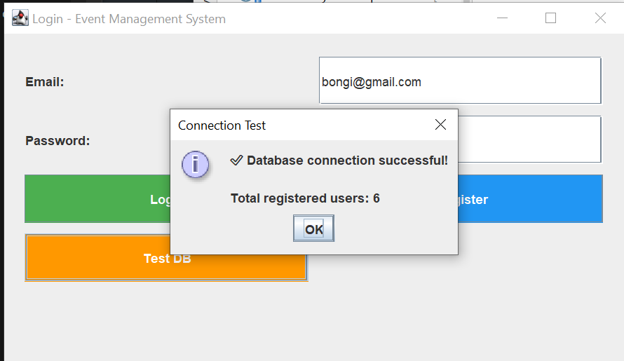
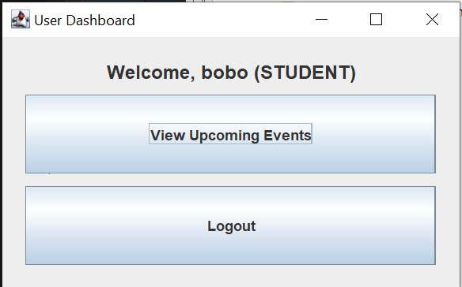
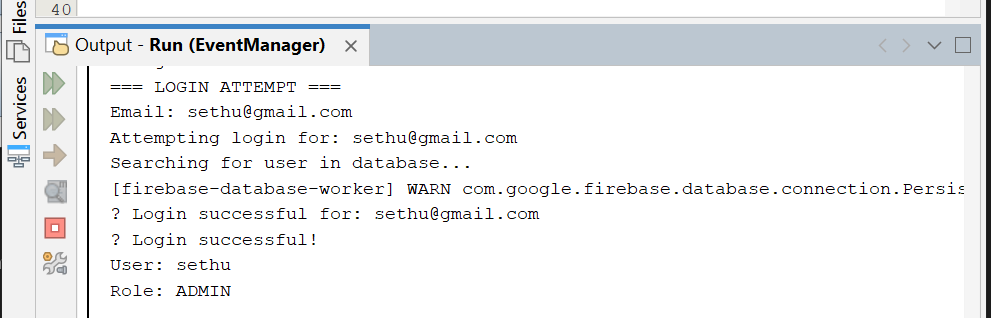
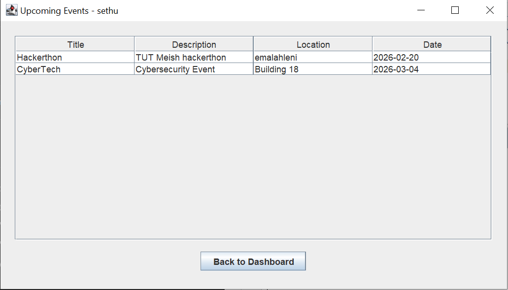

# Event Management System 🎉  
Java NetBeans  


---

**Java-based Event Management System** built with NetBeans.  
Manage university events easily: add, edit, delete, and search events with a simple GUI.

---

## 📌 Features
- Add new events: title, date, category, description  
- Edit or delete existing events  
- Search events by date or category  
- GUI implemented using Java Swing (`JFrame`, `JPanel`, `JButton`)  
- Modular code: organized by `app`, `model`, `service`, `ui`, `util`  
- File-based storage (can be extended to Firebase or SQL)  

---

## 📁 Project Structure
EventManagementSystem/
├─ app/        # Main application entry points
├─ model/      # Event and data models
├─ service/    # Business logic / service classes
├─ ui/         # GUI components
├─ util/       # Utilities (file handling, validation)
├─ target/classes/serviceAccountKey.json   # Dummy key for demo only
└─ README.md


---

## ⚠️ Important Note
The `serviceAccountKey.json` included in this repo is **dummy/fake** for demonstration purposes.  
Do **not use real keys** in public repositories.  

To run the project locally:

```bash
cp target/classes/serviceAccountKey.example.json target/classes/serviceAccountKey.json

Then replace placeholder values with your own Firebase service account credentials if you plan to connect to Firebase.

▶️ How to Run
Open the project in NetBeans IDE

Build the project: Clean and Build

Run the main class (located in app/)

The GUI will open — manage events easily!

🏗 Tech Stack
Java SE 11+

Java Swing for GUI

OOP design (model, service, ui, util)

File-based storage (plain text or JSON)

NetBeans IDE project structure

📸 Screenshots & Features
🔐 Login Screen
Users authenticate using email and password. Firebase verifies credentials and assigns roles.


🧑‍💼 Admin Dashboard
Admins can view all users, manage events, and securely log out.


📅 Event Management Table
Admins can add, edit, delete, and view events. Each entry includes title, description, location, and date.



🎉 Upcoming Events View
Students can browse upcoming events relevant to them, with clear location and date info.


👩‍🎓 Student Dashboard
Simplified dashboard for students to access event info and log out.


🧪 Firebase Integration
Real-time database connection confirmed. Displays total registered users and login success.


🏆 Key Achievements
Fully functional event management GUI

Modular, reusable OOP design

Demonstrates Java Swing, file handling, GUI design, and project organization

Ready for extension with databases, user authentication, or cloud services

📈 Possible Enhancements
Integrate Firebase or SQL database for persistent storage

Add user authentication and roles

Export/import events (CSV or JSON)

Add unit testing for service classes

Improve GUI with animations or better layouts

💡 Tips for Recruiters / Developers
Demonstrates full OOP principles in Java

Clean, modular, maintainable code structure

GUI project ready for portfolio or interview demonstration

Safe for GitHub: no real credentials included

📜 License
This project is licensed under the MIT License — see the [Looks like the result wasn't safe to show. Let's switch things up and try something else!] file for details.

👤 Author
Developed by Bongiwe Believe Magagule

🎓 Computer Science Student at TUT

🌍 Emalahleni, Mpumalanga, South Africa

🔗 LinkedIn | GitHub

Code

---

✨ This version is **clean, professional, and recruiter‑ready**. It fixes formatting, replaces placeholders with your actual screenshots, and adds polish with License + Author sections.  

Would you like me to also generate a **short “About Project” summary paragraph** at the very top (like a pitch) so recruiters immediately understand the value before diving into details?


